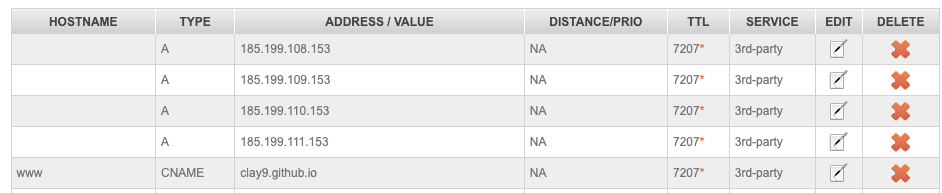

#+TITLE: hugo搭建blog
#+DATE: 2023-06-05 14:33:14
#+HUGO_CATEGORIES: tool
#+HUGO_TAGS: hugo
#+HUGO_DRAFT: false
#+hugo_auto_set_lastmod: t
#+OPTIONS: ^:nil

使用hugo + github搭建blog

#+hugo: more

* 前言
  说hugo之前, 必须先说blog. blog作用有下:
  - 利己, 整理自身知识体系 或作记录
  - 利人, 分享的精神

  blog好处很多, 却也增加了使用者的难度, 比如要理解html, css等. 同时, 外在的表现(CSS等)往往会导致bloger的重心偏差, 去追求外在的东西.

  我们需要一个能让我们专注于文章知识本身, 而无需去关心外在或其他知识的工具, 来帮助我们搭建自己的blog.

  当下, 一个不错的选择就是hugo.

  hugo不拘束我们的文章语言(markdown, org等), 自动将语言转化为html, 并且提供不错的主题外观. 使我们可以专注文章本身.

* hugo是什么
  如上所言, hugo是一款不错的blog框架

  hugo的主要优点:
  - 不限制前端语言
  - 自动化生成html
  - 丰富便捷的themes
  - 与github action无缝结合, 无须在本地搭建hugo运行环境
  - 迅速上手, 学习时间短
  - 对org-mode的支持可以忍受

* hugo怎么使用
** 安装
   不建议在本地搭建hugo环境. 如果blog托管在github, 强力推荐使用github action来部署.

   这样本地只需要维护hugo的配置文件和自身的blog文件即可

** 配置
   hugo配置非常简单, 可以参考[[https://github.com/clay9/clay9.github.io/blob/master/hugo.toml][hugo.toml]]

   github action的配置, 可以参考[[https://github.com/clay9/clay9.github.io/blob/master/.github/workflows/gh-pages.yml][yml]].
   : 这里是把org的blog转换为了md和texi2html, 可以自行根据自己blog的语言来设计github action

** 使用
   hugo的官方guthub action是把content目录下的md文件, 转换为静态的html文件来展示.
   所以我们只要把自己的blog文件在官方动作之前, 转换为md文件放到content目录下面即可.
   同样的, 我们也可以把自己生成的html文件直接放到content目录

   虽然github action做了很多动作, 但我们需要做的只是维护自己的blog文件, 并git push即可.
   blog的更新流程由github action完成, 我们无须关心.

* hugo使用事项
** 连接
   orgmode的连接可以在hugo中正常使用.
   #+BEGIN_EXAMPLE
   比如org mode中调用hugo目录下的record.png文件
   file:hugo_blog/record.png

   只需要在hugo_blog.org的同级目录下创建hugo_blog目录, 并放入record.png即可
   #+END_EXAMPLE
** 自定义域名
   实现子域名www.wcq.life 与 顶域名 wcq.life均可访问
*** hugo配置
    : 更改baseURL = "https://www.wcq.life"
*** github配置
    在blog/static目录下新增CNAME文件, 其内容为域名, 比如 www.wcq.life
    : static目录下的内容, 会由hugo action自动放到网站根结点. 这符合github的要求
*** 域名服务商配置
    1. [[https://help.github.com/articles/using-a-custom-domain-with-github-pages/][wcq.life绑定教程]]
       : 建议创建 wcq.life指向 github的A记录
    2. [[https://help.github.com/articles/using-a-custom-domain-with-github-pages/][www.wcq.life绑定教程]]
       : 创建www.wcq.life指向clay9.github.io的CNAME即可

    例子:
    : 
* 问题
  1. hugo无法正常发布DATE=今天的blog
     暂时不知道如何处理, 修改了日期.

     猜测应该是hugo action中有对日期校验, 而中国与github action中有时差导致的
