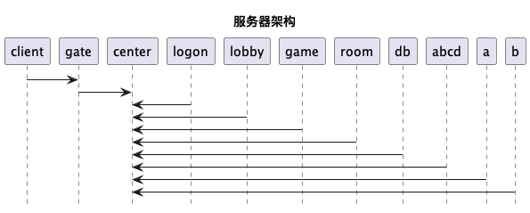
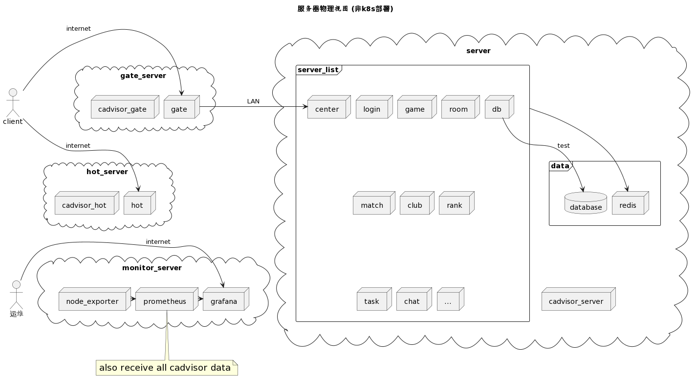

#+TITLE: 游戏
#+AUTHOR: wcq
#+OPTIONS: ^:nil
#+OPTIONS: \n:t

* 简述
** 本文目的
** 作者说

* 仓库
  当前所有仓库托管在github上,
  分别由qydocker组织管理运行环境仓库 和 qygame组织管理代码仓库

  : 基于某些原因, 有些仓库并未开源, 如果有需要, 可以联系作者

** 环境管理
   使用docker管理进程的运行环境
   涉及到的仓库
   | 仓库名                       | 作用                             | 备注                    |
   |------------------------------+----------------------------------+-------------------------|
   | [[https://github.com/qydocker/qyaction][qydocker/qyaction]]            | qygame仓库的github action        |                         |
   |------------------------------+----------------------------------+-------------------------|
   | [[https://github.com/qydocker/qycompiler][qydocker/qycompiler]]          | 构建qygame程序运行的docker镜像   |                         |
   |------------------------------+----------------------------------+-------------------------|
   | [[https://github.com/qydocker/docker-compose][qydocker/docker-compose]]      | 运行环境的docker-compose版本     |                         |
   |------------------------------+----------------------------------+-------------------------|
   | [[https://github.com/qydocker/k8s][qydocker/k8s]]                 | 运行环境的k8s版本                |                         |
   |------------------------------+----------------------------------+-------------------------|
   | [[https://github.com/qydocker/mirror_google_image][qydocker/mirror_google_image]] | google docker镜像映射到dockerhub | google 国内访问速度太慢 |
   |------------------------------+----------------------------------+-------------------------|

*** qyaction
    *目标*
    为qygame仓库的代码(kernel, frame, 子游戏)提供github action

    *流程*
    1. qygame/svr-kernel push tag的时, 触发本仓库的action.yml
    2. action.yml调用docker, docker使用Dockerfile作为配置
    3. Dockerfile中下载clay2019/qy_dev:latest 并触发docker.sh
    4. docker.sh动作
       - 下载svr-kernel仓库 && 所有子仓库
       - 执行编译动作
       - push 编译结果到 qygame/svr-publish仓库的branch svr-kernel
       - push 编译结果到 qygame/svr-publish仓库的tag    svr-kernel-$tag
       - push 编译结果到 qygame/svr-publish仓库的branch $tag
       : 后期使用拉取的时候 拉取qygame/svr-publish的branch $tag即可

*** qycompiler
    *目标*
    使用docker image来管理qygame的运行环境, 并将结果放到dockerhub clay2019/qy_dev

    *流程*
    1. 添加tag, 触发.github/workflow/main.yml
    2. main.yml中调用docker, docker根据Dockerfile启动
    3. Dockerfile中控制了程序运行环境 (第三方库及其配置)
       同时Dockerfile会启动env.sh, 配置docker image的环境配置
    4. main.yml把docker image push到dockerhub clay2019/qy_dev

**** 已接入的第三方
     | 名字                 | git地址 | 作用                    | 说明        | 备注 |
     |----------------------+---------+-------------------------+-------------+------|
     | protobuf             |         | 协议格式                |             |      |
     |----------------------+---------+-------------------------+-------------+------|
     | glog                 |         | 日志                    |             |      |
     |----------------------+---------+-------------------------+-------------+------|
     | odbc                 |         | 数据库驱动              |             |      |
     |----------------------+---------+-------------------------+-------------+------|
     | mssql drive for odbc |         |                         |             |      |
     |----------------------+---------+-------------------------+-------------+------|
     | hiredis              |         | redis api for c         |             |      |
     |----------------------+---------+-------------------------+-------------+------|
     | redis-plus-plus      |         | redis api for c++       | 依赖hiredis |      |
     |----------------------+---------+-------------------------+-------------+------|
     | qynet                |         | 网络库                  |             |      |
     |----------------------+---------+-------------------------+-------------+------|
     | lsp server:clangd    |         | lsp server, IDE语法分析 |             |      |
     |----------------------+---------+-------------------------+-------------+------|

*** docker-compose
    *目标*
    单机上的docker容器部署,
    支持dev(开发), monitor(监控)部署,
    入口为build.sh, 其通过变量控制了docker镜像版本和环境变量

    *流程*
    1. 调用build.sh, 其后的参数控制了选择哪种部署方式, 以dev为例.
       build.sh会调用到docker-compose的配置文件build_dev.yml
       : 生成的镜像versin 由git的tag控制 (在build.sh中获取)
    2. build_dev.yml中配置了各种容器信息以及容器对应的Dockerfile
    3. Dockerfile中传递了image, tag等参数
       : 对于容器qy-dev和容器qy-deploy, 传递了git的tag
       : 用来通知拉取docker-publish中的哪个tag
*** k8s
    *目标*
    docker多机器编排工具,

    *流程*
    1. k8s_set_env.sh 检测安装环境
    2. k8s_install.sh 下载并安装k8s需要的文件
    3. k8s_build.sh   创建k8s集群
    4. ingress_nginx_build.sh   安装对外接口
    5. kube_prometheus_build.sh 安装k8s监控

** 代码管理
   项目的代码管理 主要有server端代码, client代码,  protocol协议, database
   涉及到的仓库
   | 仓库名             | 作用                   | 备注           |
   |--------------------+------------------------+----------------|
   | wxlib/handy        | 网络库                 |                |
   |--------------------+------------------------+----------------|
   | [[https://github.com/qygame/svr-kernel][qygame/svr-kernel]]  | 业务与基础库的适配层   |                |
   |--------------------+------------------------+----------------|
   | [[https://github.com/qygame/svr-frame][qygame/svr-frame]]   | 业务层                 | 依赖svr-kernel |
   |--------------------+------------------------+----------------|
   | qygame/svr-$kindid | 子游戏                 | 依赖svr-frame  |
   |--------------------+------------------------+----------------|
   | [[https://github.com/qygame/protocol][qygame/protocol]]    | client与server消息协议 |                |
   |--------------------+------------------------+----------------|
   | [[https://github.com/qygame/client][qygame/client]]      | client                 |                |
   |--------------------+------------------------+----------------|
   | [[https://github.com/qygame/database][qygame/database]]    | 数据库                 |                |
   |--------------------+------------------------+----------------|
   | [[https://github.com/qygame/svr-publish][qygame/svr-publish]] | svr结果的存放位置      |                |
   |--------------------+------------------------+----------------|

*** qygame/svr-publish仓库
**** branch--master
     说明文档
**** branch--svr-kernel
     svr-kernel所有的发布结果集合
**** branch--svr-frame
     svr-frame所有的发布结果集合
**** branch--svr-$kindid
     svr-$kindid所有的发布结果集合
**** tag--$tag
     例1.0.0
     表示1.0.0版本的svr-kernel, svr-frame. svr-$kindid的发布结果汇总
     运维使用该tag即可发布正式版本
**** tag--svr-kernel-$tag
     例svr-kernel-1.0.0
     表示svr-kernel的1.0.0版本, svr-frame的1.0.0版本依赖于此
**** tag--svr-frame-$tag
     例svr-frame-1.0.0
     表示svr-frame的1.0.0版本, svr-$kindid所有子游戏的1.0.0依赖于此
**** tag--svr-$kindid-$tag
     例svr-11-1.0.0
     表示子游戏kindid=11的1.0.0版本
     tag--1.0.0需要使用到子游戏的发布结果
*** 设置tag流程
    #+BEGIN_EXAMPLE sh 命令
    mygit.sh addtag $tag
    #+END_EXAMPLE

    *流程*
    1. mygit.sh addtag $tag可以自动对所有的qygame code仓库进行添加tag
    2. 触发code仓库的.github/workflows/main.yml
    3. main.yml中触发qydocker/qyaction
    4. 之后详见 qydocker/qyaction的流程
    5. 最终结果是把server仓库的编译结果提交到svr-publish中

    *待处理*
    1. 修改tag设置流程, 没必要统一设置tag
    2. 修改qydocker/qyaction中修改对svr-publish的push. 使用latest而非tag来处理

* server
** 模块总览
    1. [X] 登陆模块 - 重复登陆，断线重连. 登陆方式的支持， 账号密码， 游客， 微信等
    2. [X] 房间列表显示模块
       - [X] 房卡场 创建界面
       - [X] 金币场 列表展示
    3. [X] 房间创建流程
    4. [X] 子游戏模块
    5. [X] 房间结束后， 信息统计
       - [X] 大局战绩
       - [X] 小局战绩
       - [X] 录像回放
       - [X] 财富修改记录
    6. [X] 任务模块
    7. [X] 排行榜
    8. [X] 比赛场
    9. [ ] 活动模块
    10. [ ] 工会

** 服务器架构
*** logic view
    #+BEGIN_SRC plantuml :file qygame/server_logic.png
      @startuml
      client -> gate : test
      @enduml
    #+END_SRC

    #+RESULTS:
    
*** implementation view
*** process view
*** deployment view
    #+begin_src plantuml :file qygame/server_deployment.png :export both
      @startuml
      title 服务器物理视图 (非k8s部署)
      skinparam nodesep 10

      together {
          actor client
          actor 运维 as ops

          client --[hidden]-> ops
      }

      together{
          cloud gate_server{
              node gate
              node cadvisor_gate
          }
          cloud hot_server {
              node hot
              node cadvisor_hot
          }

          cloud monitor_server{
              node node_exporter
              node prometheus
              node grafana
          }

          'gate_server放在hot_server之上
          gate_server --[hidden]> hot_server
          hot_server --[hidden]> monitor_server
      }

      cloud server {
          frame server_list{
              node center
              node login
              node game
              node room
              node match
              node club
              node rank
              node task
              node chat
              node db
              node "..."
          }

          frame data {
              database database
              node redis
          }

          node cadvisor_server

          cadvisor_server -[hidden]u-> data
      }

      client->gate : internet
      client->hot : internet
      gate->center :LAN
      server_list->redis
      db-->database : test

      ops->grafana : internet
      note "<size 18>also receive all cadvisor data</size>" as N1
      N1 -u-> prometheus
      node_exporter->prometheus
      prometheus->grafana

      @enduml
    #+end_src

    #+RESULTS:
    

*** use case view
** 服务器说明
   | 服务器名字 | 处理范围              | 有状态 | 状态量                        | 业务多线程 | 业务多线程原因   | 备注                           |
   |------------+-----------------------+--------+-------------------------------+------------+------------------+--------------------------------|
   | center     | 路由                  | n      |                               | n          |                  |                                |
   |------------+-----------------------+--------+-------------------------------+------------+------------------+--------------------------------|
   | db         | 数据库代理            | n      |                               | y          | database操作耗时 |                                |
   |------------+-----------------------+--------+-------------------------------+------------+------------------+--------------------------------|
   | gate       | 网关                  | y      | map[gid, uid]                 | n          | 无业务逻辑       |                                |
   |------------+-----------------------+--------+-------------------------------+------------+------------------+--------------------------------|
   | logon      | 登录                  | n      |                               | n          |                  |                                |
   |------------+-----------------------+--------+-------------------------------+------------+------------------+--------------------------------|
   | lobby      | 大厅                  | n      |                               | n          |                  |                                |
   |------------+-----------------------+--------+-------------------------------+------------+------------------+--------------------------------|
   | game       | 查询, 创建, 加入 房间 | n      |                               | n          |                  | 加载了房卡场与金币场的配置文件 |
   |------------+-----------------------+--------+-------------------------------+------------+------------------+--------------------------------|
   | match      | 比赛场服务器          | y      | match自身数据stage_index等    | n          |                  |                                |
   |            |                       |        | match_manager有map<int,match> |            |                  |                                |
   |------------+-----------------------+--------+-------------------------------+------------+------------------+--------------------------------|
   | room       | 游戏房间的具体处理    | y      | 房间数据                      | n          |                  |                                |
   |------------+-----------------------+--------+-------------------------------+------------+------------------+--------------------------------|
   | rank       | 排行榜                | y      | rank_manager有map<int,rank>   | n          |                  |                                |
   |------------+-----------------------+--------+-------------------------------+------------+------------------+--------------------------------|
   | redis      | 维护redis数据         | n      |                               | n          |                  |                                |
   |------------+-----------------------+--------+-------------------------------+------------+------------------+--------------------------------|
   | task       | 任务                  | y      | task_manager有map<int,task>   | n          |                  |                                |
   |------------+-----------------------+--------+-------------------------------+------------+------------------+--------------------------------|
   | chat       | 聊天服务器            | n      |                               | n          |                  | ready to write                 |
   |------------+-----------------------+--------+-------------------------------+------------+------------------+--------------------------------|
   | club       | 俱乐部服务器          | n      |                               | n          |                  | ready to write                 |
   |------------+-----------------------+--------+-------------------------------+------------+------------------+--------------------------------|
   | client     | 模拟client测试        | y      | ugmanager有map<gid,uid>       | n          |                  |                                |
   |------------+-----------------------+--------+-------------------------------+------------+------------------+--------------------------------|

   : 什么时候使用业务多线程
   : 当业务逻辑的处理时间耗时较久的时候, 使用业务多线程

   : 业务多线程优点 是加快了速度
   : 业务多线程缺点 编码复杂(增加了出错概率)

** 代码架构
