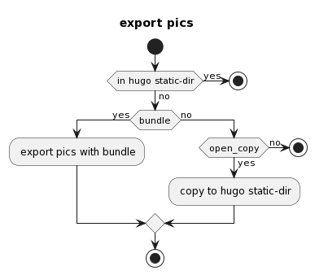

#+title: org exprot && ox-hugo
#+date: 2024-05-29 15:11:36
#+hugo_section: docs
#+hugo_bundle: emacs/org/org_export
#+export_file_name: index
#+hugo_weight: 10
#+hugo_draft: false
#+hugo_auto_set_lastmod: t
#+hugo_custom_front_matter: :bookCollapseSection false

org自带强大的export功能.
但更多的是使用ox-hugo导出hugo样式的md, 再使用hugo生成html.

#+hugo: more

* ox-hugo
** 常用样式
*** basic
    | key | format         |
    |-----+----------------|
    |     | normal         |
    | /   | /italics/        |
    | =   | =monospace=      |
    | ~   | key-binding    |
    | +   | +strike-through+ |
    | _   | _underline_      |
    |-----+----------------|
*** literal
    org 自带, literal相关
    - example
    - center
    - quote
*** html
    org 自带, html或html5
    基本不怎么使用, 容易影响hugo theme的布局 (存疑)
*** hugo shortcode
    使用的是 =hugo book theme=, 所以这里只列出与之相关的
    [[https://hugo-book-demo.netlify.app/docs/shortcodes/columns/][官方具体例子]]

    - columns
    - expand
    - hints

** 图片导出逻辑
   #+begin_src plantuml :exports results :eval no-export :file ox-hugo-export.png
     @startuml
     /'
     line direct:  -le|ri|up|do->
     line style :  #line:color;line.[bold|dashed|dotted];text:color
     '/

     'top to bottom direction
     'left to right direction

     'skinparam linetype polyline
     'skinparam linetype ortho

     'skinparam nodesep 10

     title export pics

     start
     if (in hugo static-dir) then (yes)
         stop
     else (no)
         if (bundle) then (yes)
             : export pics with bundle;
         else (no)
             if (open_copy) then (yes)
                 : copy to hugo static-dir;
             else (no)
                 stop
             endif
         endif
     endif

     stop
     @enduml
   #+end_src

   #+RESULTS:
   
